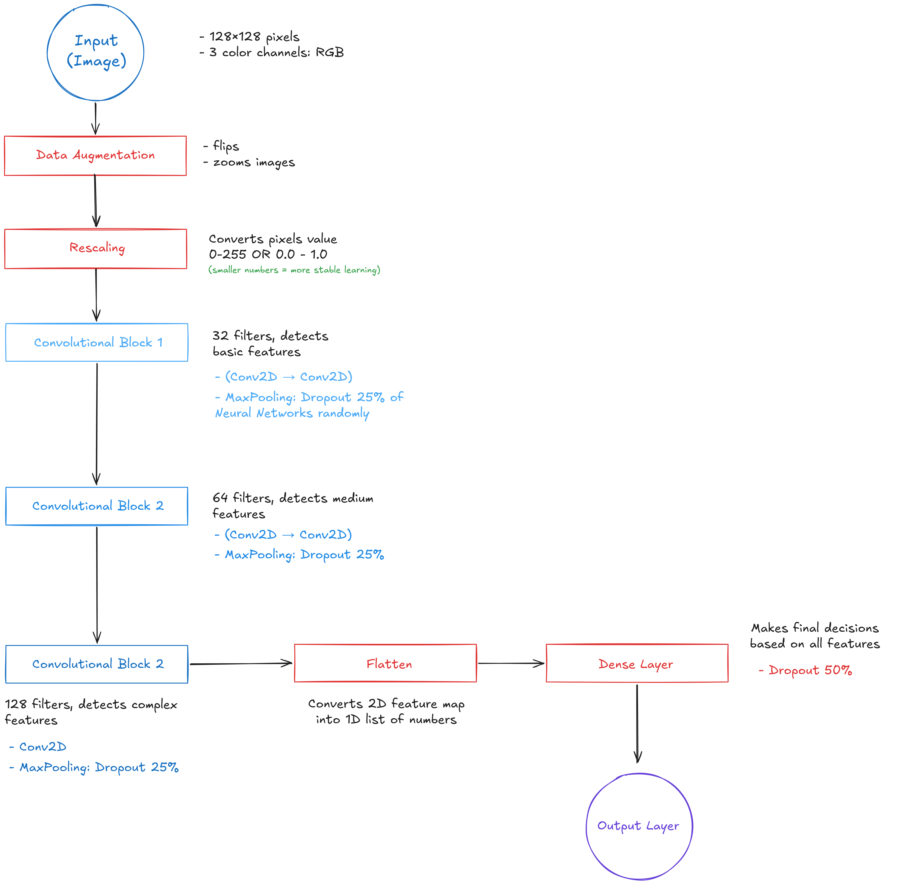

# Trash Classification Recognition

A deep learning project that uses a **Convolutional Neural Network (CNN)** to automatically classify trash images into different classes (plastic, cardboard, glass).

---

## Contents

- [Overview](#overview)
- [Installation & Setup](#installation--setup)
- [Usage](#usage)
- [Dataset Structure](#dataset-structure)
- [Model Architecture](#model-architecture)

---

## Overview

### What does it do?
This project trains a neural network to look at a photo of a piece of trash and predict what **category** it belongs to, for example:

| Input (Image) | Predicted Label |
|---|---|
|  | `plastic` |
|  | `cardboard` |
|  | `glass` |

### How does it work?
1. You give the model thousands of labeled trash photos to **learn from**.
2. The model figures out patterns startin from colors, edges, textures which will help it tell categories apart.
3. Once trained, you give it a **new photo it's never seen** and it predicts the category.

### Tech Stack
- **Python 3.9+**
- **TensorFlow / Keras**        : for building and training the neural network
- **NumPy**                     : for working with numbers and arrays
- **Matplotlib**                : for drawing training graphs

---

## Installation & Setup

### Python Installation
You need Python 3.9 or newer. Check your version by running:
```bash
python --version
```
OR
```bash
py --version
```
If you don't have Python in your device, download it from [python.org](https://www.python.org/downloads/).

### Clone this Repository
```bash
git clone https://github.com/HeyAlifian/trash-classification-recognition-python.git
cd trash-classification-recognition
```

### Install Dependencies
```bash
pip install tensorflow matplotlib numpy
```
This command allows us to install all three libraries the repo needs. It might take a few minutes or more to install, depends on how good your internet connection is.

### Verify Installation
```python
import tensorflow as tf
print(tf.__version__)
```
If you see a version number printed, it means tensorflow is installed.

---

## Usage

### Organize your Dataset
Before running anything, your images need to be sorted into subfolders by category — **one folder per label**, split into `train/` and `val/`. See the [Dataset Structure](#dataset-structure) section below for the exact layout.

### Change the Dataset Path (optional)
Open `model_train.py` and change this variable to point to your dataset folder:

```python
DATASET_DIR = "dataset"
```

### Train the model
```bash
python model_train.py
```

The script will automatically:
1. Load images from your `train/` and `val/` subfolders
2. Apply data augmentation to training images (flips, rotations, zooms)
3. Build and train the neural network
4. Save the best model as `best_model.keras`
5. Generate a training graph as `training_graph.png`

### Predict a new image
To predict a new image, you can run `app.py` by this command into your terminal:

```bash
python app.py
```

Example output:
```
🔍 Prediction for : test_bottle.jpg
   Predicted class : plastic
   Confidence      : 94.3%
   All probabilities :
      plastic         94.3%  ████████████████████
      cardboard        3.1%  ▌
      glass            2.6%  ▌
```

---

## Dataset Structure

Your dataset folder must follow this exact structure before running the script. The folder names inside `train/` and `val/` become the **category labels** automatically — no extra configuration needed!

```
dataset/
├── train/                 ← images the model LEARNS from
│   ├── plastic/
│   │   ├── plastic_001.jpg
│   │   └── plastic_002.jpg
│   ├── cardboard/
│   │   ├── cardboard_001.jpg
│   │   └── cardboard_002.jpg
│   └── glass/
│       ├── glass_001.jpg
│       └── glass_002.jpg
└── val/                   ← images used to CHECK accuracy
    ├── plastic/
    │   └── plastic_003.jpg
    ├── cardboard/
    │   └── cardboard_003.jpg
    └── glass/
        └── glass_003.jpg
```

> **Why split train and val?**
> Think of it like studying for an exam:
> - **Training data** = your study notes (the model learns from these)
> - **Validation data** = a practice test (checks if the model actually *understood*, not just memorized)

### Recommended dataset size
For good results, aim for at least **100–200 images per category**. More is always better!

| Images per category | Expected accuracy |
|---|---|
| < 50 | Poor (model doesn't have enough to learn from) |
| 100–200 | Decent (~70–85%) |
| 500+ | Good (~85–95%) |

---

## Model Architecture

The model is a **Convolutional Neural Network (CNN)**, a type of neural network specifically made to understand images.

### How a CNN "sees" an image
Instead of looking at the whole image at once, a CNN scans it with tiny filters to detect:
- **Layer 1** → Simple things: edges, color blobs
- **Layer 2** → Medium things: corners, curves, shapes
- **Layer 3** → Complex things: textures, object parts

### Layer-by-layer breakdown


### Key training settings

| Setting | Value | Why |
|---|---|---|
| Image size | 128×128 | Balance of detail vs. speed |
| Batch size | 32 | Stable training, fits in memory |
| Max epochs | 20 | Upper limit (early stopping kicks in sooner) |
| Learning rate | 0.001 | Adam optimizer's recommended default |
| Train/val split | 80% / 20% | Standard split for small datasets |

---

## Training Results

After training, the script generates a `training_graph.png` graph showing:
- **Accuracy** — how often the model predicted correctly over time
- **Loss** — how wrong the model was (lower = better)

A healthy training graph looks like this:
- Both training and validation accuracy go **up** over epochs
- Both losses go **down** over epochs
- The two lines stay **close together** (big gap = overfitting)

---

## License

This project is open source and available under the [MIT License](LICENSE)